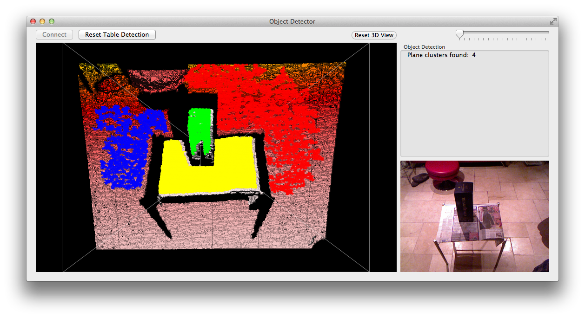

Object Detector Testing
=======================

Testing with Log and Images of the Object Detector app.

The Object Detector app differs from the Kinect Object Detector by it not using the RANSAC and Convex Hull algorithms, in favour of a plane point-clustering method.

Test Set 1
----------

Clustering algorithm complete. Starting to tune algorithm to required use.

###Before Tuning

Tuning settings:

Value							| Amount
--------------------------------|-------------
NORMAL_CALC_POINT_SPREAD		| 10
COMPARE_NORMALS_DISTANCE_THRESH	| 20.0
COMPARE_NORMALS_ANGLE_THRESH	| PI_VALUE/18
PLANE_NEIGHBOUR_SEARCH_DIST		| 1
PLANE_CLUSTER_THRESHOLD			| 2000

