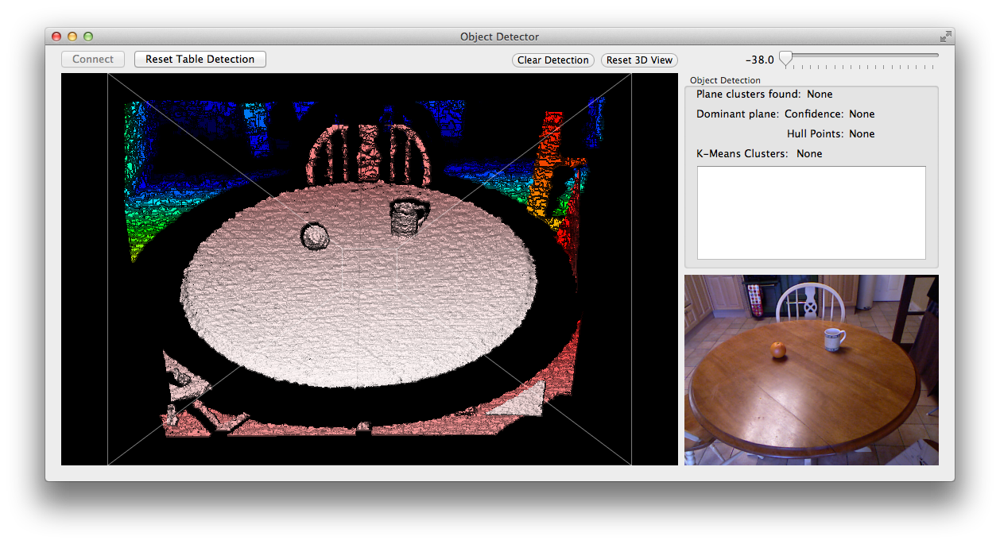
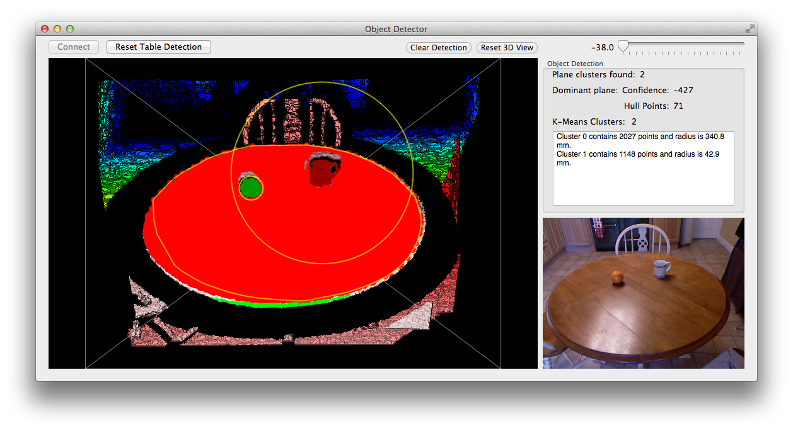

Object Detector Testing
=======================

Testing with Log and Images of the Object Detector app.

The Object Detector app differs from the Kinect Object Detector by it not using the RANSAC and Convex Hull algorithms, in favour of a plane point-clustering method.

Test Set 1 (Plain Table)
----------

Clustering algorithm complete. Starting to tune algorithm to required use.

###Before Tuning

###Using Standard Table

###Standard Table After Clustering

Tuning settings:

Value							| Amount
--------------------------------|-------------
NORMAL_CALC_POINT_SPREAD		| 10
COMPARE_NORMALS_DISTANCE_THRESH	| 20.0
COMPARE_NORMALS_ANGLE_THRESH	| PI_VALUE/18
PLANE_NEIGHBOUR_SEARCH_DIST		| 1
PLANE_CLUSTER_THRESHOLD			| 2000

Test Set 2 (Table with Mug)
----------

Now that the initial tuning is finished we can start tuning the algorithm to use with objects. In this second test we will use a typical mug. The aim now is to tune the algorithm so it only detects the table and not the mug points.

###With Mug Before Tuning

###Begin Tuning!
Value							| Amount
--------------------------------|-------------
COMPARE_NORMALS_ANGLE_THRESH	| PI_VALUE/36

Value							| Amount
--------------------------------|-------------
COMPARE_NORMALS_ANGLE_THRESH	| PI_VALUE/36
PLANE_NEIGHBOUR_SEARCH_DIST		| 2

Value							| Amount
--------------------------------|-------------
COMPARE_NORMALS_ANGLE_THRESH	| PI_VALUE/36
PLANE_NEIGHBOUR_SEARCH_DIST		| 3

Final tuning settings:

Value							| Amount
--------------------------------|-------------
NORMAL_CALC_POINT_SPREAD		| 10
COMPARE_NORMALS_DISTANCE_THRESH	| 20.0
COMPARE_NORMALS_ANGLE_THRESH	| PI_VALUE/36
PLANE_NEIGHBOUR_SEARCH_DIST		| 3
PLANE_CLUSTER_THRESHOLD			| 2000

Test Set 3 (Table with Mug & Orange)
----------

Now tune the settings so that the algorithm excludes the orange as well.

###With Mug & Orange Before Tuning

Tuning seems to be sufficient here. Minimal tweaking will be done and the results observed. There are some minor positions (typically around objects) where the table points have not been detected. Let's see if we can fix this.

###Begin Tuning!
After observation, the distance threshold seemed very high. At 20mm the distance two points can be to make a plane is very high. Setting this to 10mm proved that there was no reduction in the detection of the table plane.

Value							| Amount
--------------------------------|-------------
COMPARE_NORMALS_DISTANCE_THRESH	| 10.0

After some more tuning it was found that gradually decreasing the normal angle threshold gave the desired plane point clustering without the inclusion of the orange and mug points.

Value							| Amount
--------------------------------|-------------
COMPARE_NORMALS_DISTANCE_THRESH	| 10.0
COMPARE_NORMALS_ANGLE_THRESH	| PI_VALUE/26

Final tuning settings:

Value							| Amount
--------------------------------|-------------
NORMAL_CALC_POINT_SPREAD		| 10
COMPARE_NORMALS_DISTANCE_THRESH	| 10.0
COMPARE_NORMALS_ANGLE_THRESH	| PI_VALUE/26
PLANE_NEIGHBOUR_SEARCH_DIST		| 3
PLANE_CLUSTER_THRESHOLD			| 2000

More Settings To Use
--------------------

Added the settings:

Value							| Amount
--------------------------------|-------------
RANSAC_DISTANCE_TOLERANCE		| 10.0
CONVEXHULL_DISTANCE_TOLERANCE	| 20.0
INCLUSION_MAX_HEIGHT			| 500.0
INCLUSION_MIN_HEIGHT			| 10.0
KMEANS_CLUSTER_COUNT			| 2
KMEANS_FILTER_DISTANCE			| 100

Test Set 4 (After addition of Object Segmentation)
----------

Many more features have now been added to the object detection process. There is now the inclusion of all the functions called in `ObjectDetection::segmentObjects()`. These work quite simply and do not require tweaking settings in order to get optimal performance. However

###With Mug & Orange Before Object Segmentation Tuning

It is apparent that the k-means clustering is including too many points (noise) in its final clusters. This could be due to the inclusion stage including too many points that are part of the table, or it could be that the KMEANS_FILTER_DISTANCE is too high.

###Begin Tuning

Final tuning settings:

Value							| Amount
--------------------------------|-------------
NORMAL_CALC_POINT_SPREAD		| 10
COMPARE_NORMALS_DISTANCE_THRESH	| 10.0
COMPARE_NORMALS_ANGLE_THRESH	| PI_VALUE/26
PLANE_NEIGHBOUR_SEARCH_DIST		| 3
PLANE_CLUSTER_THRESHOLD			| 2000
RANSAC_DISTANCE_TOLERANCE		| 20.0
CONVEXHULL_DISTANCE_TOLERANCE	| 20.0
INCLUSION_MAX_HEIGHT			| 500.0
INCLUSION_MIN_HEIGHT			| 15.0
KMEANS_CLUSTER_COUNT			| 3
KMEANS_FILTER_DISTANCE			| 50.0

